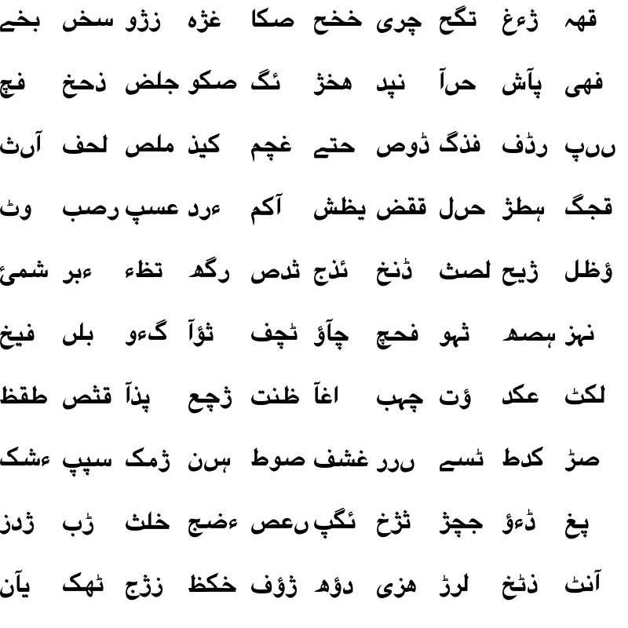

# Neural Style Transfer For Urdu Fonts

## Motivation
Creating font is hard, and then creating an Urdu font is an even harder. To make a font for Urdu, designers will need to design unique looks for every Urdu character and every character combined with other characters, a effort that could take much time to complete.
What if the designer just creates a subset of characters, then let computer figures out what the rest supposed to look like?
This project is an explorational take on this using deep learning. Specifically, the whole font design process is formulated as a style transfer problem
from a standard look font, to an stylized target font. A neural network is trained to approximate the transformation in between two fonts given a subset of pairs of examples. Once the learning is finished, it can be used to
infer the shape for the rest of characters.
<p align="center">
  
</p>

## Network Structure
We considered many structures and architectures for our network so that our task can complete accurately and within reasonable time, the structure we chose is shown below.
<p align="center">
  
</p>

### Observations: 
* The input into the network is (160x160) and the targeted output is low resolution (80x80) because we want to preserve the quality of the image and avoid blurriness.
* There is a batch normalization layer after every convolutional layer and then after that there is a ReLu layer, and also zero padding is done.
* The minimization function we used is Mean Absolute Error (MAE) between the ground truth and predicted output. We did not use the commonly used Mean Squared Error (MSE) because it was giving blurry image.
* We used different size of convolutions on different levels because we want to capture the details at different levels, rather than using same size for all which makes converging difficult.
* The ‘n’ in layers is configurable, which means you can increase the size of n from 2 to 4, higher the value of n, it will give clear and detailed output with increased training time.
* The Dropout is very important for the convergence, if we do not use dropout layer, the results are just black and white images.


## Visualizations
### Progress during training
We trained the network on 2300 examples with number of layers equals to 3 and iterations equals to 4000. We can see how interesting it is that it converges from complete black noisy image to somehow rough shape of characters and then details keeps on adding with more iterations as it trains through the network.

<video width="320" height="240">
  <source src="/images/transition.mp4" type="video/mp4">
</video>

## Usage
### Requirements
To use this, TensorFlow is required to be installed. Also a GPU is highly recommended, if you expect to see the result in reasonable amount of time.

Prior to training, you need to run the preprocess script to generate character bitmaps for both source and target fonts:

```sh
python preprocess.py --source_font source_font.ttf \
                     --target_font target_font.otf \
                     --char_list charsets/urducharset.txt \ 
                     --save_dir bitmap_path
```
The preprocess script accepts both TrueType and OpenType fonts, take a list of characters (some common charsets are builtin in the charsets directory in this repo) then save the bitmaps of those characters in **.npy** format. By default, for the source font, each character will be saved with font size 64 on a 160x160 canvas, and target font with size 32 on 80x80 canvas, with respect.

 

After the preprocess step, you have the bitmaps for both source and target fonts, run the below command to start the training:

```sh
python rewrite.py --mode=train \ 
                  --model=medium \
                  --source_font=src.npy \
                  --target_font=tgt.npy \ 
                  --iter=4000 \
                  --num_examples=2300 \
                  --num_validations=100 \
                  --tv=0.0001 \
                  --alpha=0.2 \
                  --keep_prob=0.5 \ 
                  --num_ckpt=10 \
                  --ckpt_dir=path_to_save_checkpoints \ 
                  --summary_dir=path_to_save_summaries\
                  --frame_dir=path_to_save_frames
```

* **model**: here represents the size of the model. The are 3 options: small, medium and big, 2,3,4 layers respectively.
* **tv**: the weight for the total variation loss, default to 0.0001. If the output is broken, you can choose to increase it to force the model to generate smoother output
* **alpha**: the alpha slope used by leaky relu.
* **keep_prob**: represents the probability a value passing through the Dropout layer during training. This is actually a very important parameter, the higher the probability, the sharper but potentially broken output is expected. 0.5 is the recommended option.
* **ckpt_dir**: the directory to store model checkpoints.
* **summary_dir**: if you wish to use TensorBoard to visualize some metrics, like combined loss, this is the place to save all the summaries.
* **frame_dir**: the directory to save the captured output on **validation** set. After the training, you can also find a file named **transition.gif** to show you the animated progress the model made during training, on validation set.

You can use **-h** for other options.

## Future Work
* Optimization of transfer of font from one style to another.
* Consideration of other stylistic features(at least one) which can be implemented.
* Consideration of generation of proportional fonts with Kerning using Neural Network.
